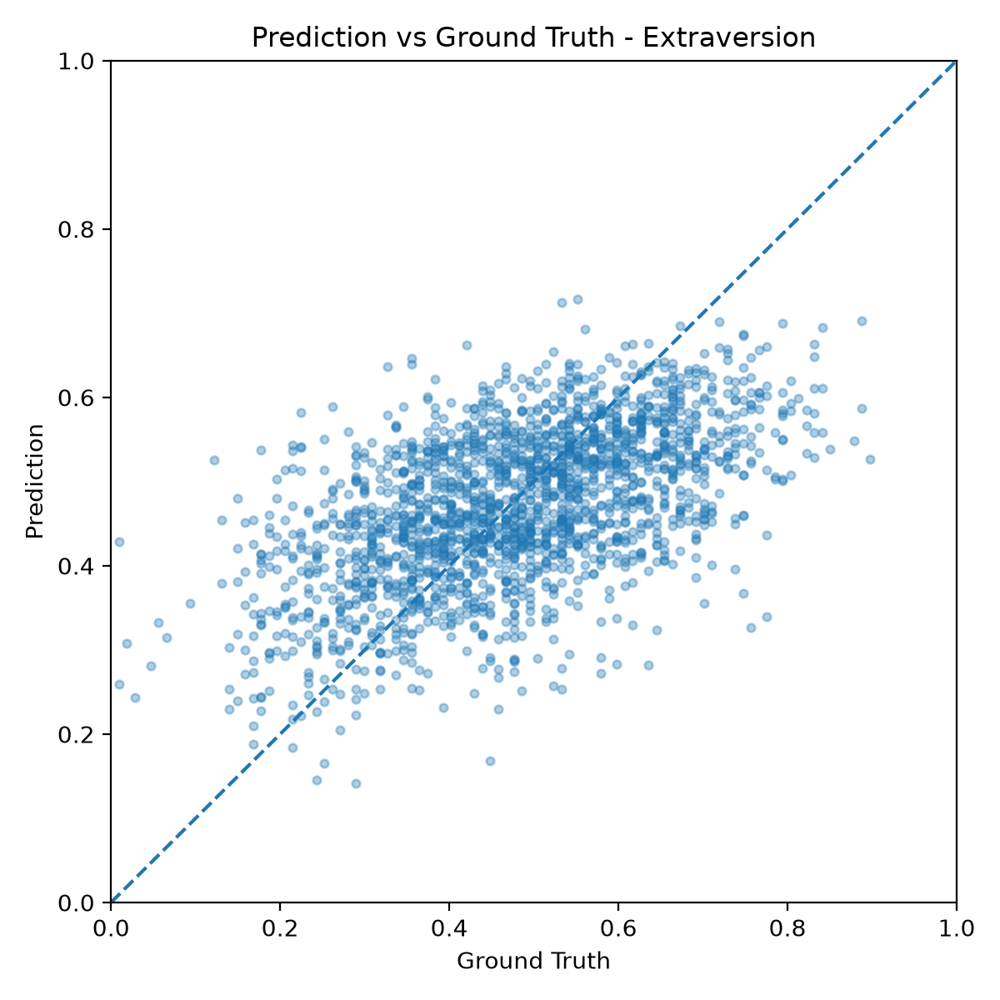
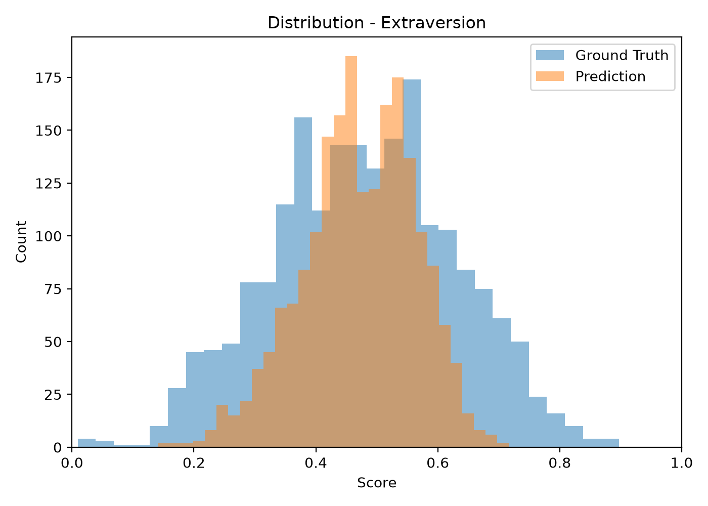
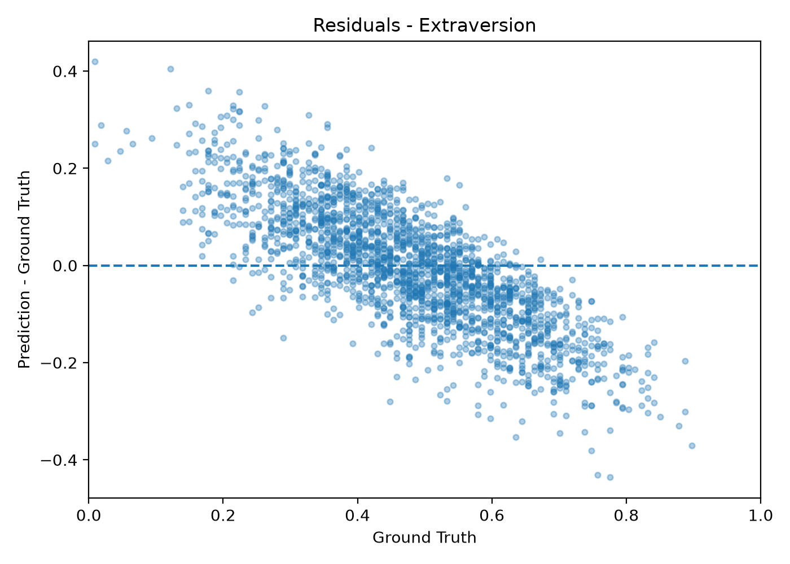

# Personality Trait Prediction from Audio and Video

A multimodal deep learning framework for **Big Five personality trait prediction** using the **ChaLearn First Impressions V2** dataset.

The project combines **audio** and **visual** information extracted from short video clips to predict continuous personality scores for the five Big Five personality traits.

---

# Overview

This repository implements a multimodal regression model in **PyTorch** for automatic personality trait prediction.

Each video is represented using two complementary modalities:

- **Audio:** Mel Frequency Cepstral Coefficients (MFCCs)
- **Video:** RGB frames processed by a pretrained ResNet18 backbone

The extracted features are fused to predict the following personality traits:

- Extraversion
- Neuroticism
- Agreeableness
- Conscientiousness
- Openness

The original train / validation / test split provided by the ChaLearn First Impressions V2 dataset is preserved throughout all experiments.

---

# Dataset

The project uses the **ChaLearn First Impressions V2** dataset.

Each sample consists of:

- approximately 15-second video clip
- one speaker facing the camera
- continuous personality annotations in the range **[0,1]**
- five Big Five personality traits

Dataset structure

```
data/
└── raw/
    └── first_impressions_v2/
```

---

# Data Preprocessing

## Audio

For every video:

- audio extraction
- 24 MFCC coefficients
- sample-wise standardization
- zero-padding to a fixed temporal length

Final audio tensor

```
(1, 24, 1319)
```

---

## Video

For every video:

- uniform sampling of 6 RGB frames
- resize
- random crop during training
- center crop during validation/testing
- normalization

Final video tensor

```
(6, 3, 128, 128)
```

---

# Model Architecture

The proposed model consists of four modules.

```
               +----------------+
               | Video Frames   |
               +----------------+
                       |
                 ResNet18 Backbone
                       |
                 Temporal Average
                       |
                Linear Projection
                       |
                       |
                       +-----------+
                                   |
                                   |
                               Concatenate
                                   |
                                   |
                       +-----------+
                       |
                 Audio CNN Encoder
                       |
                Linear Projection
                       |
                       |
                Regression Head
                       |
                 Five Personality
                     Predictions
```

---

# Audio Encoder

- Convolutional Neural Network
- Batch Normalization
- ReLU activations
- MaxPooling
- Fully connected projection

Output

```
256-dimensional embedding
```

---

# Video Encoder

Visual backbone

- pretrained ResNet18

Training strategy

- ImageNet pretrained weights
- frozen backbone
- Layer4 fine-tuning

Temporal aggregation

- average pooling over the sampled frames

Output

```
256-dimensional embedding
```

---

# Fusion

The audio and video embeddings are concatenated

```
256 + 256 → 512
```

before being passed to the regression head.

---

# Regression Head

Fully connected layers predict the five personality traits.

Final activation

```
Sigmoid
```

to constrain the predictions inside

```
[0,1]
```

---

# Training

Loss

```
L1 Loss (Mean Absolute Error)
```

Optimizer

```
Adam
```

Initial learning rate

```
1e-3
```

Learning-rate scheduler

```
ReduceLROnPlateau
factor = 0.5
patience = 3
minimum LR = 1e-5
```

Training epochs

```
20
```

Evaluation metric

```
1 − MAE
```

---

# Results

## Final Test Performance

| Metric | Value |
|---------|-------:|
| **MAE** | **0.0982** |
| **1 − MAE** | **0.9018** |

Trait-wise MAE

| Trait | MAE |
|------|------:|
| Extraversion | **0.0999** |
| Neuroticism | **0.0984** |
| Agreeableness | **0.0946** |
| Conscientiousness | **0.1024** |
| Openness | **0.0954** |

---

## Pearson Correlation

| Trait | Pearson r |
|------|----------:|
| Extraversion | **0.558** |
| Neuroticism | **0.597** |
| Agreeableness | **0.462** |
| Conscientiousness | **0.549** |
| Openness | **0.568** |

---

# Prediction Analysis

To better understand the model behaviour, the repository automatically generates:

- Prediction vs Ground Truth scatter plots
- Prediction and Ground Truth distributions
- Residual plots
- Pearson correlation statistics

An example for the **Extraversion** trait is shown below.

| Prediction vs Ground Truth | Distribution | Residuals |
|:--------------------------:|:------------:|:---------:|
|  |  |  |

Equivalent figures are automatically generated for all five personality traits and are available in

```
outputs/figures/prediction_analysis_plateau/
```

---

# Experimental Comparison

Several configurations were evaluated during development.

| Configuration | MAE | 1 − MAE |
|---------------|----:|---------:|
| Baseline concatenation model | **0.1000** | **0.9000** |
| **+ ReduceLROnPlateau (final model)** | **0.0982** | **0.9018** |

The final model achieved the best overall performance by introducing a **ReduceLROnPlateau** learning-rate scheduler, allowing the optimizer to reduce the learning rate automatically whenever the validation MAE stopped improving.

---

# Repository Structure

```
.
├── data/
├── models/
├── outputs/
├── scripts/
├── slurm/
├── src/
├── README.md
└── requirements.txt
```

---

# Main Scripts

Training

```
python scripts/train.py
```

or

```
sbatch slurm/train.sbatch
```

Evaluation

```
python scripts/evaluate.py
```

Prediction analysis

```
python scripts/analyze_predictions.py
```

Dataset inspection

```
python scripts/inspect_dataset.py
```

DataLoader check

```
python scripts/check_dataloader.py
```

Model summary

```
python scripts/model_summary.py
```

---

# Future Work

Possible future improvements include

- temporal modeling with LSTM or GRU
- Transformer-based multimodal fusion
- attention mechanisms
- distribution-aware regression losses
- uncertainty estimation
- improved handling of the regression-to-the-mean effect

---

# Requirements

Main dependencies

- PyTorch
- TorchVision
- NumPy
- OpenCV
- Librosa
- Matplotlib
- Pandas
- Scikit-learn

Install all dependencies with

```
pip install -r requirements.txt
```

---

# References

Escalante et al.

**First Impressions: Apparent Personality Analysis Challenge**

ChaLearn First Impressions V2 Dataset

CVPR Workshops.