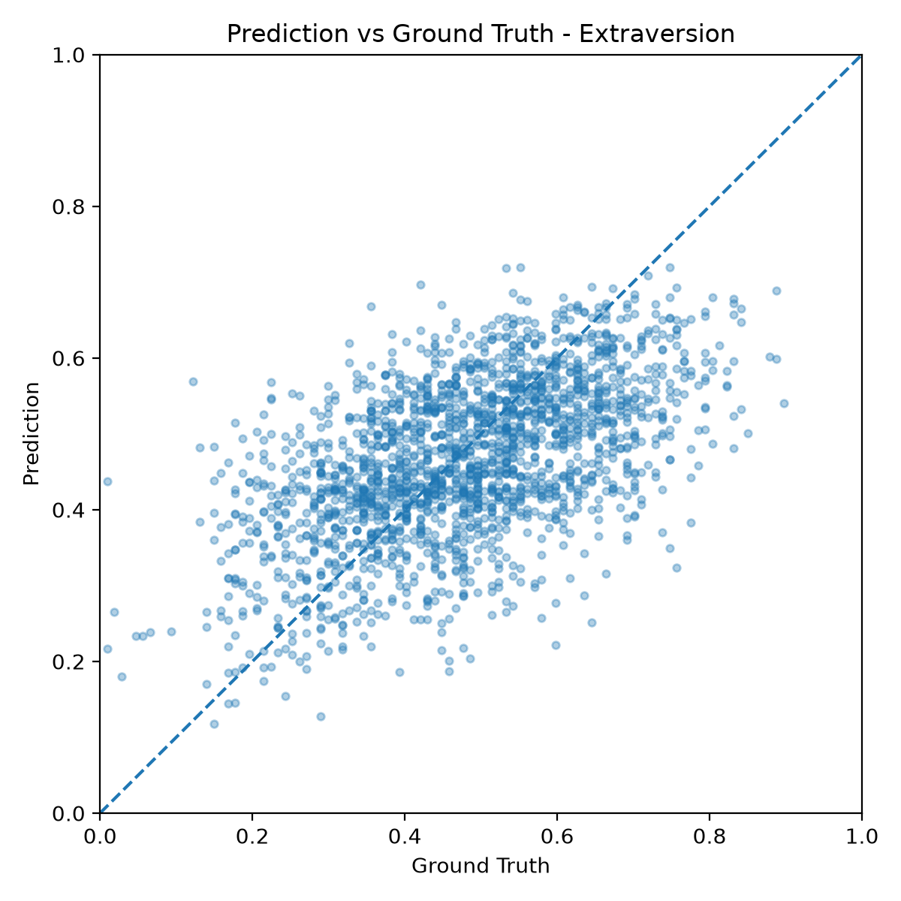
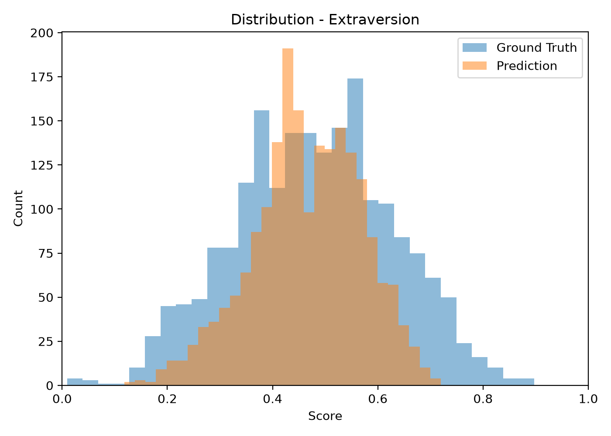
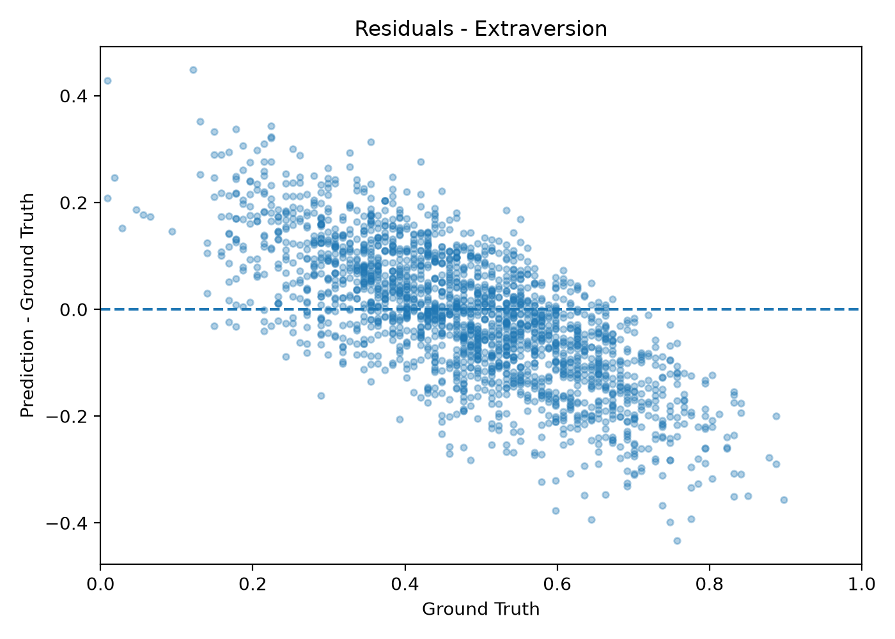

# Personality Trait Prediction from Audio and Video

A multimodal deep learning framework for **Big Five personality trait prediction** using the **ChaLearn First Impressions V2** dataset.

The project combines **audio** and **visual** information extracted from short video clips to predict continuous personality scores for the five Big Five traits.

---

## Overview

This repository implements a multimodal regression model in **PyTorch** for automatic personality trait prediction.

Each video is represented by two complementary modalities:

- **Audio:** Mel Frequency Cepstral Coefficients (MFCCs)
- **Video:** RGB frames processed by a pretrained ResNet18

The extracted representations are fused and used to predict the following personality traits:

- Extraversion
- Neuroticism
- Agreeableness
- Conscientiousness
- Openness

The implementation follows the original train/validation/test split provided by the ChaLearn First Impressions V2 dataset.

---

## Dataset

The project uses the **ChaLearn First Impressions V2** dataset.

Each sample consists of:

- approximately 15-second video clip
- one speaker facing the camera
- continuous annotations in the range **[0,1]**
- five personality traits

Dataset structure:

```
data/
└── raw/
    └── first_impressions_v2/
```

---

## Data Preprocessing

### Audio

For each video:

- audio extraction
- 24 MFCC coefficients
- sample-wise standardization
- zero-padding to fixed length

Final audio tensor:

```
(1, 24, 1319)
```

---

### Video

For each video:

- uniform sampling of 6 frames
- resize
- random crop during training
- center crop during validation/testing
- normalization

Final video tensor:

```
(6, 3, 128, 128)
```

---

# Model Architecture

The model consists of four modules.

```
               +----------------+
               | Video Frames   |
               +----------------+
                       |
                 ResNet18 Backbone
                       |
                 Temporal Average
                       |
                Linear Projection
                       |
                       |
                       +-----------+
                                   |
                                   |
                               Concatenate
                                   |
                                   |
                       +-----------+
                       |
                 Audio CNN Encoder
                       |
                Linear Projection
                       |
                       |
                Regression Head
                       |
                 Five Personality
                     Predictions
```

---

## Audio Encoder

- Convolutional neural network
- Batch Normalization
- ReLU activations
- MaxPooling
- Fully connected projection

Output:

```
256-dimensional feature vector
```

---

## Video Encoder

Visual backbone:

- pretrained ResNet18

Training strategy:

- pretrained ImageNet weights
- frozen backbone
- only the final ResNet block (Layer4) fine-tuned

Temporal aggregation:

- average pooling over the sampled frames

Output:

```
256-dimensional feature vector
```

---

## Fusion

The audio and visual embeddings are concatenated:

```
256 + 256 → 512
```

---

## Regression Head

Fully connected layers predict the five personality traits.

Final activation:

```
Sigmoid
```

to constrain predictions within

```
[0,1]
```

---

# Training

Loss:

```
L1Loss (Mean Absolute Error)
```

Optimizer:

```
Adam
```

Learning rate:

```
1e-3
```

Training epochs:

```
20
```

Metric:

```
1 − MAE
```

---

# Results

## Best Test Performance

| Metric | Value |
|---------|--------|
| MAE | **0.1000** |
| 1 − MAE | **0.9000** |

Trait-wise MAE:

| Trait | MAE |
|------|------:|
| Extraversion | 0.1015 |
| Neuroticism | 0.1007 |
| Agreeableness | 0.0957 |
| Conscientiousness | 0.1053 |
| Openness | 0.0968 |

---

## Prediction Analysis

To better understand the model behavior, the repository provides a comprehensive analysis of the predictions, including:

- Prediction vs. Ground Truth scatter plots
- Prediction and Ground Truth distributions
- Residual plots
- Pearson correlation statistics

An example for the **Extraversion** trait is shown below.

| Prediction vs. Ground Truth | Distribution | Residuals |
|:---------------------------:|:------------:|:---------:|
|  |  |  |

Equivalent figures are automatically generated for all five personality traits and are available in:

```text
outputs/figures/prediction_analysis/
```

---

# Repository Structure

```
.
├── data/
├── models/
├── outputs/
├── scripts/
├── slurm/
├── src/
├── README.md
└── requirements.txt
```

---

# Main Scripts

## Training

```
python scripts/train.py
```

or

```
sbatch slurm/train.sbatch
```

---

## Evaluation

```
python scripts/evaluate.py
```

---

## Prediction Analysis

```
python scripts/analyze_predictions.py
```

---

## Dataset Inspection

```
python scripts/inspect_dataset.py
```

---

## DataLoader Check

```
python scripts/check_dataloader.py
```

---

## Model Summary

```
python scripts/model_summary.py
```

---

# Experimental Analysis

Several architectural variants were investigated during development, including:

- different fusion strategies
- weighted MAE loss
- differential learning rates
- partial fine-tuning of the visual backbone

The best performing configuration was obtained using:

- concatenation fusion
- pretrained ResNet18
- Layer4 fine-tuning
- standard MAE loss

---

# Future Work

Possible improvements include:

- temporal modeling with LSTM/GRU
- Transformer-based fusion
- attention mechanisms
- distribution-aware regression losses
- uncertainty estimation
- improved handling of regression-to-the-mean

---

# Requirements

Main dependencies:

- PyTorch
- TorchVision
- NumPy
- OpenCV
- Librosa
- Matplotlib
- Pandas
- Scikit-learn

Install all dependencies with

```
pip install -r requirements.txt
```

---

# References

ChaLearn First Impressions V2

Escalante et al.

"First Impressions: Apparent Personality Analysis Challenge"

CVPR Workshops.